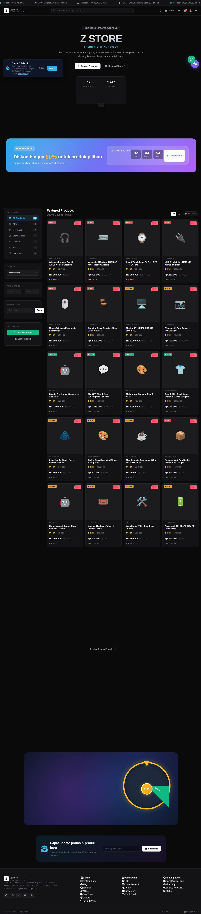

# Z Store

**Premium Digital Marketplace** — AI tools · Software · Vouchers · Game accounts · Hosting · Jasa

Instant delivery via email · Pembayaran via Midtrans (QRIS / VA / GoPay / ShopeePay / CC) · Garansi 30 hari.

🌐 **Live**: https://zcus.biz.id/shop/

---

## Desktop Preview

> Sleek dark theme · Hairline borders · Single sky-blue accent · 8px spacing grid · Inter typeface · 4-column product grid.

### Home Page — Full View



### What You're Looking At

| Region | Description |
|---|---|
| **Top bar** | Promo strip with rotating trust signals (instant delivery, secure pay, flash sale countdown, CS WhatsApp) |
| **Header** | Sticky navigation — brand mark, search, theme toggle, orders, wishlist, cart (live count), account |
| **Hero** | "Z STORE — PREMIUM DIGITAL ACCESS" with live stock badge + dual CTA + 4-stat card (products sold, buyers, delivery time) |
| **Categories** | 7 quick-link chips — AI Tools, Voucher, Digital Goods, Merchandise, Software, Hosting, Game |
| **Flash Sale** | Gradient banner with live countdown timer + "Lihat Promo" CTA |
| **Trust strip** | 5-item horizontal — `<10min Delivery`, `Full Warranty`, `100% Original`, `Secure Payment`, `24/7 Support` |
| **Sidebar** | Category filter (with counts), sort dropdown, price range, promo code, WhatsApp/Email support |
| **Product grid** | 4-column responsive grid (2-col mobile), 20+ products with badges (HOT/DEAL/NEW), ratings, strikethrough pricing, stock indicators |
| **Footer** | 4-column footer — brand + social, store links, payment methods, contact info, legal strip |

### Design System

```
Background      #0a0a0b  (deep neutral black)
Surface 1       #131316
Surface 2       #1c1c1f
Hairline        rgba(255,255,255,0.08)
Accent          #38bdf8  (sky blue — single functional accent)
Text            #fafafa  /  #a1a1aa  /  #71717a  (3-tier hierarchy)
Type            Inter, system fallbacks
Spacing         8px grid
Radius          8px (down from glassmorphism's 12-18px)
No              orbs · gradient mesh · backdrop blur · glow
```

---

## Stack

| Layer | Tech |
|---|---|
| Frontend | Static HTML + vanilla JS + CSS — no build step |
| Backend | Node.js 22 + Express 4 + mysql2/promise |
| Database | MySQL 8 (23 tables, escrow + audit log) |
| Auth | JWT (30d) + bcrypt(12) + TOTP 2FA optional |
| Payment | Midtrans Snap (sandbox default) |
| Process | PM2 (`z-store`) |
| Network | nginx → Cloudflare → Tunnel → VPS2 |
| DB | MySQL on VPS4 over Tailscale |

---

## Project Structure

```
z-store/
├── backend/
│   ├── server.js            # 1786 LOC, 93 routes
│   ├── security.js          # 299 LOC middleware (CSP, CORS, rate-limit, injection guard)
│   ├── schema.sql + v4-v7   # DB migrations (apply in order)
│   ├── test-security.sh     # 44 security tests (SQLi/XSS/DDoS/rate limit/headers)
│   └── test-features.sh     # 24 feature smoke tests
├── frontend/shop/           # 18 pages, styles.css, app.js, products.js
└── docs/                    # ARCHITECTURE / SECURITY / API / DEPLOYMENT / DATABASE / TESTING
```

---

## Status (June 2026)

| Area | Status | Details |
|---|---|---|
| Security tests | **39/44 pass (89%)** | See [docs/SECURITY.md](docs/SECURITY.md) |
| Feature tests | 12/24 (50%) | See [docs/TESTING.md](docs/TESTING.md) |
| Auth (register/login/JWT/2FA) | ✅ Production | bcrypt(12) + JWT 30d + TOTP |
| Midtrans payments (sandbox) | ✅ Tested | Real prod toggle via env var |
| Escrow + auto-release | ✅ Production | 7-day default + admin force-release |
| UI redesign (sleek/minimal) | ✅ v3 deployed | See [CHANGELOG.md](docs/CHANGELOG.md) |
| Promo codes + Newsletter | ⚠ Migration needed | Run `schema-v7-promos.sql` on VPS4 |

---

## Quickstart (Local)

```bash
# Clone
git clone https://github.com/zcuss/z-store.git
cd z-store

# Frontend dev server (port 3002)
cd frontend/shop
node dev-server.js
# → open http://localhost:3002

# Backend (optional — without DB, API returns 503, frontend falls back to local PRODUCTS)
cd ../../backend
npm ci
node server.js   # → http://localhost:3001
```

See [docs/DEVELOPMENT.md](docs/DEVELOPMENT.md) for full setup.

---

## Documentation

- [docs/README.md](docs/README.md) — Docs index
- [docs/ARCHITECTURE.md](docs/ARCHITECTURE.md) — System architecture + stack
- [docs/SECURITY.md](docs/SECURITY.md) — Security audit + hardening playbook
- [docs/API.md](docs/API.md) — REST API endpoint reference
- [docs/DEPLOYMENT.md](docs/DEPLOYMENT.md) — VPS2 + VPS4 + cPanel + Cloudflare setup
- [docs/DEVELOPMENT.md](docs/DEVELOPMENT.md) — Local dev + code style + gotchas
- [docs/DATABASE.md](docs/DATABASE.md) — Schema (23 tables) + ERD
- [docs/TESTING.md](docs/TESTING.md) — Test suites + known gaps
- [docs/CHANGELOG.md](docs/CHANGELOG.md) — Versioned changelog

---

## Repo

- **GitHub**: github.com/zcuss/z-store
- **Live**: https://zcus.biz.id/shop/
- **API**: https://zcus.biz.id/shop-app/api

## License

Proprietary. © 2026 Z Store.
